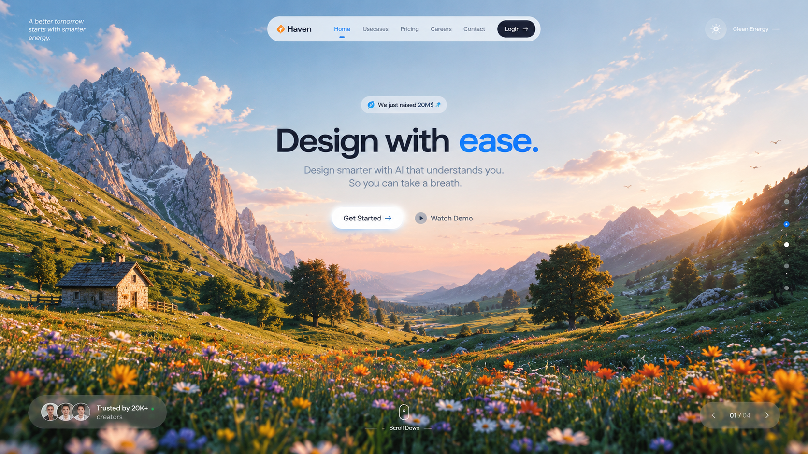

 

# TRYNVEXA

### Frontend Developer · UI Engineer · Creative Coder

  I build interfaces that feel <b>simple</b>, <b>fast</b>, and <b>alive</b>.

 

&nbsp;

 

## `01` — ABOUT

<table>
<tr>
<td width="55%" valign="top">

### Building digital experiences.

I'm a frontend developer focused on turning ideas into clean,
responsive and interactive interfaces.

I care about:

- thoughtful UI
- smooth interactions
- responsive layouts
- performance
- clean code
- useful products

 

┌──────────────────────────────────────┐
│  DESIGN → CODE → MOTION → PRODUCT  │
└──────────────────────────────────────┘
