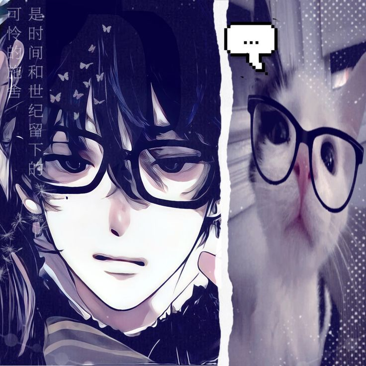

<div align="center">


<br>



<br>


</div>

<br>

<table>
<tr>
<td width="58%" valign="top">

## 👨‍💻 About Me

Halo, saya **Zikri** 👋

Saya seorang **Frontend Developer berusia 16 tahun** yang sedang menempuh pendidikan di **SMK Swasta Mandiri**.

Saya suka belajar dan mengembangkan kemampuan di dunia teknologi, khususnya dalam bidang **web development**.

Saya terus belajar, berkarya, dan membangun berbagai project untuk meningkatkan kemampuan saya sebagai developer.

<br>

### ⚡ DEVELOPER STATUS

```text
┌─────────────────────────────────────┐
│  ROLE        → Frontend Developer   │
│  STATUS      → Student              │
│  CURRENT     → Learning & Building  │
│  FOCUS       → Web Development      │
│  MODE        → Code • Debug • Build │
└─────────────────────────────────────┘
```

</td>

<td width="42%" align="center" valign="middle">


<br><br>


</td>
</tr>
</table>

<br>

---

<div align="center">

## 🌐 Connect With Me

<a href="https://instagram.com/rick_watts7">

</a>
&nbsp;
<a href="https://tiktok.com/@frince_nael7">

</a>
&nbsp;
<a href="mailto:zikriganteng2023@gmail.com">

</a>

</div>

<br>

<table>
<tr>

<td width="33%" align="center">

### 💻 ROLE

**Frontend Developer**

Building modern interfaces and interactive web experiences.

</td>

<td width="33%" align="center">

### 🚀 FOCUS

**Web Development**

Learning, experimenting, and creating new projects.

</td>

<td width="33%" align="center">

### 🧠 MINDSET

**Learn → Build → Improve**

Every project is another step forward.

</td>

</tr>
</table>

<br>

---

# 🛠️ TECH STACK

<div align="center">

### 🔤 Languages


<br><br>

### ⚛️ Frameworks & Libraries


<br><br>

### 🗄️ Backend & Database


<br><br>

### 🎨 Design & Creative


<br><br>


<br><br>

### ☁️ Tools, Deployment & Platforms


<br><br>


<br><br>

### 🎮 Gaming & Hardware


</div>

<br>

---

<table>
<tr>

<td width="33%" align="center">

## 💻 CODING MODE

### 👨‍💻 CODE

Write
Build
Experiment

</td>

<td width="33%" align="center">

### 🐛 DEBUG

Find problems
Test solutions
Fix & improve

</td>

<td width="33%" align="center">

### 🚀 BUILD

Idea → Design
Design → Code
Code → Project

</td>

</tr>
</table>

<br>

---

# 📚 CURRENTLY LEARNING

<table>
<tr>

<td width="33%" align="center">

### 📖 LEARNING

Frontend Development

Vue.js
JavaScript
UI Development

</td>

<td width="33%" align="center">

### 🎯 FOCUS

Creating interfaces that are:

**Clean**
**Responsive**
**Interactive**

</td>

<td width="33%" align="center">

### 🚀 GOALS

Become a better developer.

Build bigger projects.

Keep improving every day.

</td>

</tr>
</table>

<br>

---

# 📊 GITHUB DASHBOARD

<table>
<tr>

<td width="33%" align="center">

### 📈 OVERVIEW


</td>

<td width="33%" align="center">

### 🔥 STREAK


</td>

<td width="33%" align="center">

### 🧩 LANGUAGES


</td>

</tr>
</table>

<br>

---

# 🎮 BEYOND CODE

<table>
<tr>

<td width="33%" align="center">

### 🎮 GAMING

Mobile Legends
PC Games
Game Development

</td>

<td width="33%" align="center">

### 🎵 MUSIC

Listening to music
Discovering new songs
Relaxing with music

</td>

<td width="33%" align="center">

### 🏸 BADMINTON

Play
Practice
Have fun

</td>

</tr>
</table>

<br>

---

<div align="center">

## 🧠 MINDSET


<br><br>

**LEARN • BUILD • DEBUG • IMPROVE • REPEAT**

<br><br>


</div>
